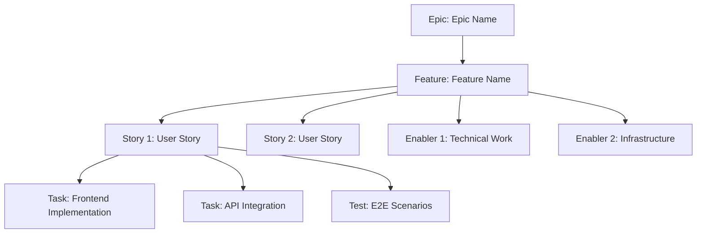

# GitHub Issue Planning & Project Automation

## Goal

Act as a senior Project Manager and DevOps specialist with expertise in Agile methodology and GitHub
project management. Take the complete set of inception artifacts (requirements, user stories,
architecture/design, unit decomposition) and generate a comprehensive project plan with an
Epic > Feature > Story/Enabler > Test hierarchy, dependency linking, priority assignment, and
Kanban-style tracking.

> **SDLC integration**: In this repository the breakdown plan is a **mandatory output of the
> inception phase**. It is produced by the `plan` node (after `unit-decomposition`) and stored under
> `sdlc-docs/inception/plan/`. Its exit gate requires human approval before construction begins.

## GitHub Project Management Best Practices

### Agile Work Item Hierarchy

- **Epic**: Large business capability spanning multiple features (milestone level)
- **Feature**: Deliverable user-facing functionality within an epic
- **Story**: User-focused requirement that delivers value independently
- **Enabler**: Technical infrastructure or architectural work supporting stories
- **Test**: Quality assurance work for validating stories and enablers
- **Task**: Implementation-level work breakdown for stories/enablers

### Project Management Principles

- **INVEST Criteria**: Independent, Negotiable, Valuable, Estimable, Small, Testable
- **Definition of Ready**: Clear acceptance criteria before work begins
- **Definition of Done**: Quality gates and completion criteria
- **Dependency Management**: Clear blocking relationships and critical path identification
- **Value-Based Prioritization**: Business value vs. effort matrix for decision making

## Input Requirements

Use the approved inception artifacts:

1. **Requirements**: `sdlc-docs/inception/requirements/requirements.md` (REQ- ids)
2. **User Stories**: `sdlc-docs/inception/requirements/user-stories.md` (US- ↔ REQ-)
3. **Architecture & Design**: `sdlc-docs/inception/architecture-design/architecture-design.md` (ADR- ids)
4. **Unit Registry**: `sdlc-docs/construction/units/unit-registry.yaml` (UNIT- ids)

## Output Format

Create two primary deliverables (mandatory inception outputs):

1. **Project Plan**: `sdlc-docs/inception/plan/project-plan.md`
2. **Issue Creation Checklist**: `sdlc-docs/inception/plan/issues-checklist.md`

Every work item must carry traceability back to the inception ids (REQ-/US-/ADR-/UNIT-).

### Project Plan Structure

#### 1. Project Overview

- **Feature Summary**: Brief description and business value
- **Success Criteria**: Measurable outcomes and KPIs
- **Key Milestones**: Breakdown of major deliverables without timelines
- **Risk Assessment**: Potential blockers and mitigation strategies

#### 2. Work Item Hierarchy

#### 3. GitHub Issues Breakdown

Provide Epic, Feature, User Story, and Technical Enabler issue templates with description, acceptance
criteria, dependencies (Blocks / Blocked by), Definition of Done, labels, parent references, and
estimates. Each issue references its traceability ids.

#### 4. Priority and Value Matrix

| Priority | Value  | Criteria                        | Labels                            |
| -------- | ------ | ------------------------------- | --------------------------------- |
| P0       | High   | Critical path, blocking release | `priority-critical`, `value-high` |
| P1       | High   | Core functionality, user-facing | `priority-high`, `value-high`     |
| P1       | Medium | Core functionality, internal    | `priority-high`, `value-medium`   |
| P2       | Medium | Important but not blocking      | `priority-medium`, `value-medium` |
| P3       | Low    | Nice to have, technical debt    | `priority-low`, `value-low`       |

#### 5. Estimation Guidelines

- **Story points (Fibonacci)**: 1 (<4h), 2 (<1d), 3 (1-2d), 5 (3-5d), 8 (1-2w), 13+ (needs breakdown)
- **T-shirt sizing (Epics/Features)**: XS (1-2), S (3-8), M (8-20), L (20-40), XL (40+)

#### 6. Dependency Management

Document Blocks / Related / Prerequisite / Parallel relationships and the critical path.

#### 7. Sprint Planning Template

Capacity planning (velocity, buffer 20%, focus factor 70-80%) and a sprint goal template.

#### 8. GitHub Project Board Configuration

- **Columns (Kanban)**: Backlog → Sprint Ready → In Progress → In Review → Testing → Done
- **Custom fields**: Priority, Value, Component, Estimate, Sprint, Assignee, Epic

#### 9. Automation and GitHub Actions

Optional `github-script` workflows for automated issue creation and status transitions
(open → In Review, merged → Done).

### Issue Creation Checklist

Produce `issues-checklist.md` covering pre-creation preparation, epic-level, feature-level, and
story/enabler-level checklist items with INVEST compliance, estimates, dependencies, and acceptance
criteria.

## Success Metrics

- **Project management KPIs**: sprint predictability, cycle time, lead time, defect escape rate, velocity
- **Process efficiency**: issue creation time, dependency resolution, status update accuracy,
  documentation completeness
- **Delivery**: Definition of Done compliance, acceptance-criteria coverage, sprint-goal achievement,
  planning accuracy

## Completion Checks

Before finalizing, verify:
1. Every Epic/Feature/Story/Enabler/Test traces to at least one REQ-/US-/ADR-/UNIT- id.
2. Dependencies and the critical path are explicit.
3. Priorities and estimates are assigned.
4. Both deliverables exist under `sdlc-docs/inception/plan/`.
