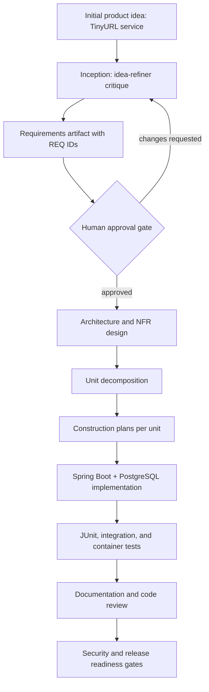
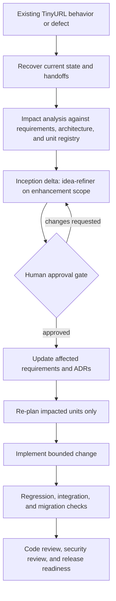

# agentic-sdlc-tinyurl

An **agentic SDLC orchestrator** built with GitHub Copilot **custom agents, hooks, and skills**.
It coordinates the full software lifecycle as a governed, non-linear, stateful process — an explicit
dependency graph with entry/exit gates, human-approval checkpoints, bounded failure recovery,
compensating actions, and an append-only audit trail.

> Reference model (not a dependency): [awslabs/aidlc-workflows `core-workflow.md`](https://github.com/awslabs/aidlc-workflows/blob/main/aidlc-rules/aws-aidlc-rules/core-workflow.md).
> No aidlc extensions are used (those target Kiro IDE).

## Highlights

- **Explicit DAG** with conditional branching, parallel paths, and join synchronization — not linear chaining.
- **Idea refinement in Inception**: the `idea-refiner` skill challenges the initial idea or draft
  requirements before requirements are approved.
- **Two governance modes**: Inception is single-threaded and human-gated; Construction is multi-agent with concurrent autonomy.
- **Gates** = human approval and/or automated policy checks (security, compliance, change control).
- **High-impact actions** (core feature / critical design) are agent-classified and **human-confirmed**.
- **Bounded recovery**: retry ≤ 3, then fallback / rollback / safe-stop to the last approved stage; compensating actions for non-reversible effects.
- **Human decisions** for re-planning, parallel conflicts, and release readiness.
- **Append-only markdown audit** preserving decision lineage.

## Completed Tasks

| # | Task | Description |
|---|------|-------------|
| 1 | Built the agentic SDLC custom orchestrators with custom agents and skills | Designed and implemented the top-level `sdlc-orchestrator` alongside the single-threaded `inception` and multi-agent `construction` sub-agents, backed by the full skill set (orchestration, gate/policy approval, handoff, unit construction, traceability, failure recovery, audit logging) that governs the end-to-end lifecycle. |
| 2 | Completed TinyURL Phase 1 as a greenfield build | Took the TinyURL service from an initial product idea through idea refinement, approved requirements, architecture and unit decomposition, and Construction — delivering the Spring Boot + PostgreSQL implementation with tests, documentation, code review, and release-readiness gates. |
| 3 | Completed the brownfield enhancements | Applied the brownfield flow to evolve the existing TinyURL codebase: recovered current state and handoffs, ran impact analysis against requirements/architecture/unit registry, refined the enhancement scope, updated affected requirements and ADRs, and re-planned and implemented only the impacted units with regression and integration checks. |
| 4 | Completed ambiguous requirements handling as Phase 3 | The initial "improve performance" requirement was flagged as ambiguous and untestable by the `idea-refiner` skill during idea refinement; refinement narrowed its scope to a concrete, testable target — improving bulk URL creation performance — which was then carried through requirements approval, design, and Construction. |

## TinyURL Project Brief

This repository is prepared to build a URL shortener service from scratch with core APIs,
analytics, and reliability features. The intended implementation stack is Java, Spring Boot,
PostgreSQL, Maven, and Docker containers, governed through the agentic SDLC workflow in this repo.

## Agentic SDLC Process

The workflow starts with Inception, where requirements are refined, approved, and converted into
architecture and unit decomposition artifacts. The `idea-refiner` skill is explicitly used at the
start of the `requirements` node to challenge the TinyURL idea, expose untestable requirements,
identify missing edge cases, and turn the brief into approval-ready requirements.

Construction then runs implementation, tests, documentation, code review, security review, and
release-readiness checks through governed gates. The imported awesome-copilot skill and instruction
pack adds Spring Boot, JUnit, PostgreSQL, SQL review, Dockerfile, dependency, security, CI/CD, and
quality guidance to those phases.

### Greenfield Requirements Flow



### Brownfield Enhancement Flow



## Imported Copilot Assets

Selected skills from `github/awesome-copilot` now live under `.github/skills/`:

- `create-spring-boot-java-project`, `java-springboot`, `spring-boot-testing`, `java-junit`
- `postgresql-code-review`, `postgresql-optimization`, `sql-code-review`
- `multi-stage-dockerfile`, `security-review`, `quality-playbook`, `dependabot`
- `create-implementation-plan`, `create-specification`

Selected instruction files from `github/awesome-copilot` now live under `.github/instructions/`:

- `springboot.instructions.md`, `java-junit5-assertions.instructions.md`
- `containerization-docker-best-practices.instructions.md`
- `code-review-generic.instructions.md`, `security-and-owasp.instructions.md`
- `github-actions-ci-cd-best-practices.instructions.md`

## Structure

```
docs/spec/
  agentic-sdlc-orchestrator-spec.md      # binding spec (v1, locked)
  agentic-sdlc-orchestrator-v2-spec.md   # v2 addendum (handoffs, units, templates, standards, hybrid gates)
  decision-log.md                        # grilling Q&A lineage
.github/
  sdlc/
    workflow-graph.yaml                  # DAG + v2 node fields (agent, templates, standards, handoff, evidence)
    templates/                           # 15 mandatory artifact templates (v2 §4)
    rules/                               # common, standards, inception, construction, extensions (v2 §5/§6)
    schemas/                             # handoff, unit-registry, approval schemas
  agents/
    sdlc-orchestrator.agent.md           # top-level coordinator
    inception.agent.md                   # single-threaded, human-gated
    construction.agent.md                # multi-agent, concurrent autonomy by unit
  instructions/                          # imported stack/code-review guidance from awesome-copilot
  skills/
    sdlc-orchestration/SKILL.md          # graph resolution, branching, synchronization
    gate-approval/SKILL.md               # entry/exit gate = approval + policy check
    policy-gate/SKILL.md                 # hybrid policy gate (pass|fail|block|error) (v2 §7)
    subagent-handoff/SKILL.md            # durable handoff artifacts (v2 §2)
    unit-construction/SKILL.md           # decomposed unit execution + safe parallelism (v2 §3)
    template-compliance/SKILL.md         # mandatory templates + durable approvals (v2 §4/§8)
    traceability/SKILL.md                # REQ-/ADR-/UNIT-/PLAN-/TEST-/DOC-/SEC-/CR-/REL- (v2 §9)
    failure-recovery/SKILL.md            # retry/fallback/rollback/safe-stop + compensating actions
    audit-log/SKILL.md                   # append-only state + audit writes
    idea-refiner/SKILL.md                # inception idea and requirements critique
    java-springboot/                     # imported Spring Boot guidance
    postgresql-code-review/              # imported PostgreSQL review guidance
    multi-stage-dockerfile/              # imported Dockerfile guidance
  hooks/
    hooks.json                           # lifecycle hook manifest
    scripts/audit-append.sh              # append-only audit writer (lock-serialized)
    scripts/gate-check.sh                # hybrid policy + high-impact durable-approval enforcement
    scripts/graph-validate.sh            # validate v2 graph fields + template/standard refs (v2 §10)
    scripts/handoff-validate.sh          # validate handoff artifacts (v2 §2)
    scripts/approval-check.sh            # verify durable high-impact approvals (v2 §8)
sdlc-docs/
  state.md                               # resumable run state
  audit-log.md                           # append-only audit trail
  approvals/  handoffs/  policy-evidence/  # durable v2 evidence (v2 §7/§8/§2)
  inception/  construction/  release-readiness/  # generated lifecycle artifacts (v2 §11)
```

## Running the TinyURL Project Locally

The TinyURL application itself lives under `tiny-url-creator/` (`backend/` = Spring Boot + Maven,
`frontend/` = Angular). Prerequisites: **Java 17**, **Maven** (or the bundled `./mvnw`), **Docker**
(for local PostgreSQL), and **Node.js/npm** (Angular 17 CLI).

1. **Start PostgreSQL for the backend `dev` profile:**
   ```bash
   cd tiny-url-creator/backend
   docker compose up -d
   ```
   This starts a `postgres:16-alpine` container (`tinyurl` db/user/password) on port `5432`.

2. **Run the backend API:**
   ```bash
   cd tiny-url-creator/backend
   ./mvnw spring-boot:run
   ```
   The API starts on `http://localhost:8080` using the `dev` Spring profile (`application-dev.yml`).
   Run `./mvnw test` to execute the JUnit test suite (uses an in-memory H2 `test` profile, no Docker needed).

3. **Run the frontend Angular app:**
   ```bash
   cd tiny-url-creator/frontend
   npm install
   npm start
   ```
   This runs `ng serve` on `http://localhost:4200`, proxying `/api` requests to the backend on
   port `8080` via `proxy.conf.json`. Run `npm test` for the Karma/Jasmine unit tests.

4. **Use the app:** open `http://localhost:4200` in a browser to create and manage short links, or
   call the API directly, e.g. `POST http://localhost:8080/api/links`.

To stop the local database: `docker compose down` from `tiny-url-creator/backend` (add `-v` to also
drop the `tinyurl-pgdata` volume).

## Getting started

1. Make hook scripts executable:
   ```bash
   chmod +x .github/hooks/scripts/*.sh
   ```
2. Open the workspace in VS Code and select the **`sdlc-orchestrator`** custom agent.
3. Describe the change you want to build. The orchestrator resolves the graph in
   `.github/sdlc/workflow-graph.yaml`, enforces gates, and records lineage in `sdlc-docs/`.

## Spec

See [docs/spec/agentic-sdlc-orchestrator-spec.md](docs/spec/agentic-sdlc-orchestrator-spec.md) for
the binding v1 specification, [docs/spec/agentic-sdlc-orchestrator-v2-spec.md](docs/spec/agentic-sdlc-orchestrator-v2-spec.md)
for the v2 addendum (subagent handoffs, decomposed units, mandatory templates, local rules/standards,
hybrid policy gates, durable approvals, traceability), and
[docs/spec/decision-log.md](docs/spec/decision-log.md) for the decisions behind them.