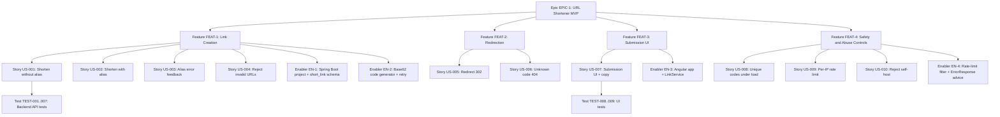
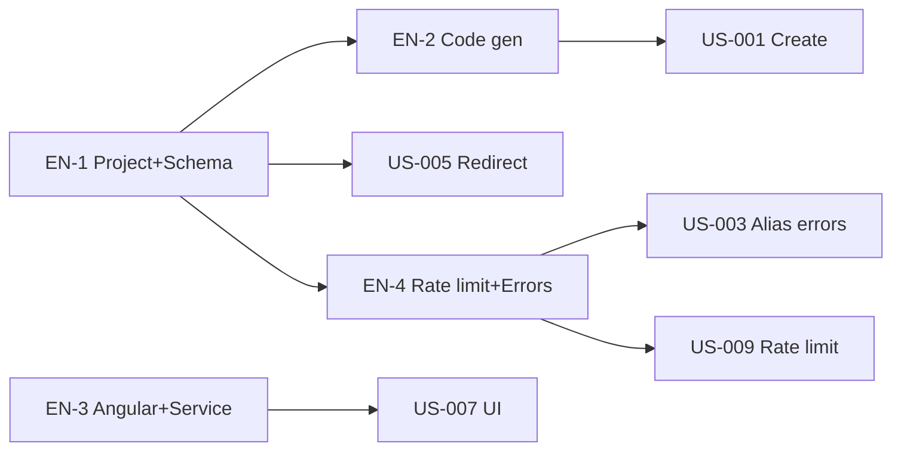

<!-- template_id: project-plan-template.md -->

# Project Plan — TinyURL URL Shortener (Phase 1 MVP)

- **template_id**: project-plan-template.md
- **run_id**: run-20260801T232309Z
- **node_id**: plan
- **authored_by**: inception
- **status**: draft
- **skill**: breakdown-plan
- **sources**: requirements.md (REQ-001..010), user-stories.md (US-001..010),
  architecture-design.md (ADR-001..009), unit-registry.yaml (UNIT-001/002)

## 1. Project overview (required)

- **Summary & business value**: Deliver an MVP URL shortener that lets anonymous users convert long
  URLs into short shareable links (with optional custom alias) and redirect via the short link,
  through a simple web UI. Value: faster sharing, memorable links, foundation for future analytics.
- **Success criteria / KPIs**:
  - 100% of REQ-001..REQ-010 acceptance criteria pass automated tests.
  - Redirect p95 ≤ 100 ms; creation p95 ≤ 300 ms (NFR).
  - Zero open high/critical security findings at release readiness.
- **Key milestones** (no timelines):
  - M1 Backend API functional (create + redirect + validation + rate limit).
  - M2 Frontend submission UI wired to the API.
  - M3 Tests green (unit + integration) and docs complete.
  - M4 Release-readiness review passed.
- **Risk assessment**:
  - RISK-002 (medium, accepted): public redirect abuse — mitigated by scheme allowlist, max length,
    self-host rejection, per-IP rate limiting.
  - RISK-004 (low): in-memory rate limiter is per-instance (single-instance MVP).
  - RISK-005 (low): frontend/backend integration verified in the testing node.

## 2. Work item hierarchy (required)

## 3. Issues breakdown (required)

### Epic — EPIC-1: URL Shortener MVP
- **Description**: Anonymous URL shortening + redirect + submission UI (Phase 1).
- **Acceptance criteria**: REQ-001..REQ-010 satisfied; NFRs met; release-readiness passed.
- **Features**: FEAT-1, FEAT-2, FEAT-3, FEAT-4.
- **Labels**: `epic`, `priority-critical`, `value-high` · **Estimate**: M (8–20 pts) · **Traces**: all REQ/ADR/UNIT.

### Feature — FEAT-1: Link Creation (UNIT-001)
- **Stories**: US-001, US-002, US-003, US-004 · **Enablers**: EN-1, EN-2
- **Acceptance**: create with/without alias; validation + collision errors correct.
- **Blocked by**: EN-1 · **Labels**: `feature`, `priority-high`, `value-high`, `backend` · **Estimate**: S
- **Traces**: REQ-001/002/003/004; ADR-003/004/006/007/009.

### Feature — FEAT-2: Redirection (UNIT-001)
- **Stories**: US-005, US-006 · **Acceptance**: 302 for known, 404 for unknown.
- **Blocked by**: EN-1 · **Labels**: `feature`, `priority-high`, `value-high`, `backend` · **Estimate**: XS
- **Traces**: REQ-005/006; ADR-005/009.

### Feature — FEAT-3: Submission UI (UNIT-002)
- **Stories**: US-007 · **Enablers**: EN-3 · **Acceptance**: form submits, shows short URL + copy, inline errors.
- **Blocked by**: none at build time (fixed API contract); integration verified in testing.
- **Labels**: `feature`, `priority-high`, `value-high`, `frontend` · **Estimate**: S · **Traces**: REQ-007; ADR-002.

### Feature — FEAT-4: Safety & Abuse Controls (UNIT-001)
- **Stories**: US-008, US-009, US-010 · **Enablers**: EN-4
- **Acceptance**: unique codes under concurrency; 429 on rate limit; 400 on self-host.
- **Labels**: `feature`, `priority-high`, `value-medium`, `backend`, `security` · **Estimate**: S
- **Traces**: REQ-008/009/010; ADR-004/007/008/009.

### User Stories (INVEST)
| Story | Statement (abbrev.) | AC source | Labels | Est |
|-------|---------------------|-----------|--------|-----|
| US-001 | Shorten without alias | REQ-001 | `user-story`,`backend`,`P1` | 2 |
| US-002 | Shorten with alias | REQ-002 | `user-story`,`backend`,`P1` | 2 |
| US-003 | Alias error feedback | REQ-003 | `user-story`,`backend`,`P1` | 2 |
| US-004 | Reject invalid URLs | REQ-004 | `user-story`,`backend`,`P1` | 2 |
| US-005 | Redirect 302 | REQ-005 | `user-story`,`backend`,`P0` | 1 |
| US-006 | Unknown code 404 | REQ-006 | `user-story`,`backend`,`P1` | 1 |
| US-007 | Submission UI + copy | REQ-007 | `user-story`,`frontend`,`P1` | 3 |
| US-008 | Unique codes under load | REQ-008 | `user-story`,`backend`,`P1` | 2 |
| US-009 | Per-IP rate limit | REQ-009 | `user-story`,`backend`,`P2` | 3 |
| US-010 | Reject self-host | REQ-010 | `user-story`,`backend`,`P2` | 1 |

### Technical Enablers
| Enabler | Description | Enables | Labels | Est |
|---------|-------------|---------|--------|-----|
| EN-1 | Spring Boot project, `short_link` entity + repo + H2/Postgres config | US-001..006,008 | `enabler`,`backend`,`database`,`P0` | 3 |
| EN-2 | Base62 `SecureRandom` code generator + collision retry | US-001,008 | `enabler`,`backend`,`P1` | 2 |
| EN-3 | Angular app scaffold + `LinkService` HTTP client | US-007 | `enabler`,`frontend`,`P1` | 3 |
| EN-4 | Per-IP rate-limit filter + `@RestControllerAdvice` `ErrorResponse` | US-003,004,009,010 | `enabler`,`backend`,`security`,`P1` | 3 |

### Tests
| Test | Covers | Labels |
|------|--------|--------|
| TEST-001..007 | Backend create/redirect/validation/rate-limit (UNIT-001) | `test`,`backend` |
| TEST-008..009 | UI submit + error display (UNIT-002) | `test`,`frontend` |

## 4. Priority & value matrix (required)

| Item | Priority | Value | Labels |
|------|----------|-------|--------|
| US-005 (redirect), EN-1 | P0 | High | `priority-critical`,`value-high` |
| FEAT-1/2/3, US-001..004/006/007/008, EN-2/3/4 | P1 | High | `priority-high`,`value-high` |
| US-009/010 (safety) | P2 | Medium | `priority-medium`,`value-medium` |

## 5. Estimation (required)

- **Total story points**: ~30 (stories 19 + enablers 11). Epic size **M**.
- Fibonacci per item as tabulated above.

## 6. Dependency management & critical path (required)

- **Critical path**: EN-1 → EN-2 → US-001/002 → US-003/004 → US-008 (backend core).
- **Parallel**: UNIT-002 (EN-3 → US-007) runs concurrently with UNIT-001 (disjoint files).
- **Prerequisite**: EN-1 blocks all backend stories.

## 7. Sprint / board configuration (required)

- **Board columns**: Backlog → Sprint Ready → In Progress → In Review → Testing → Done.
- **Custom fields**: Priority (P0–P3), Value, Component (frontend/backend/security/database),
  Estimate, Sprint, Assignee, Epic.
- **Capacity**: single delivery increment; 20% buffer; focus factor 70–80%.
- **Sprint 1 goal**: EN-1, EN-2, US-001..006 (backend create + redirect).
- **Sprint 2 goal**: EN-3, EN-4, US-007..010 (UI + safety) + tests/docs.
- **Automation (optional)**: `github-script` to open issues from this plan; PR open → In Review,
  merged → Done.

## 8. Traceability (required)

| Work item | REQ | US | ADR | UNIT |
|-----------|-----|----|-----|------|
| FEAT-1 | 001–004 | 001–004 | 003,004,006,007,009 | UNIT-001 |
| FEAT-2 | 005,006 | 005,006 | 005,009 | UNIT-001 |
| FEAT-3 | 007 | 007 | 002 | UNIT-002 |
| FEAT-4 | 008,009,010 | 008,009,010 | 004,007,008,009 | UNIT-001 |
| EN-1 | 001,005,008 | — | 003 | UNIT-001 |
| EN-2 | 001,008 | 001,008 | 004 | UNIT-001 |
| EN-3 | 007 | 007 | 002 | UNIT-002 |
| EN-4 | 003,004,009,010 | 003,004,009,010 | 007,008,009 | UNIT-001 |
| TEST-001..007 | 001–006,008,009,010 | — | — | UNIT-001 |
| TEST-008..009 | 007 | 007 | 002 | UNIT-002 |

## 9. Open questions (required)

N/A — the plan is derived entirely from approved inception artifacts; no open questions remain.
