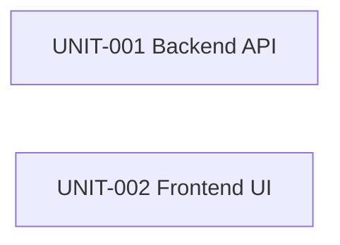
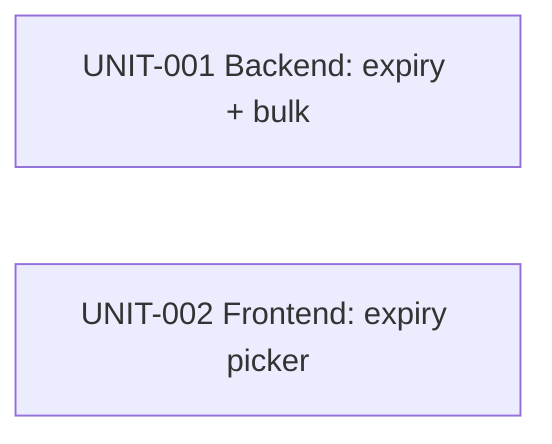
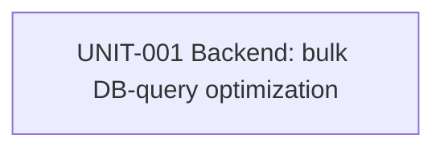

<!-- template_id: unit-decomposition-template.md -->

# Unit Decomposition — TinyURL URL Shortener

- **template_id**: unit-decomposition-template.md
- **run_id**: run-20260801T232309Z (Phase 1, approved) · run-20260802T150051Z (Phase 2, approved) · run-20260802T170000Z (Phase 3, in review)
- **node_id**: unit-decomposition
- **registry_output**: sdlc-docs/construction/units/unit-registry.yaml
- **status**: Phase 1 approved · Phase 2 approved · Phase 3 (§8) pending exit-gate approval

## 1. Decomposition rationale (required)

The design (ADR-001..ADR-009) cleanly separates a **Spring Boot backend** (all business logic, data
model, validation, rate limiting, redirect) from an **Angular frontend** (submission UI). These live
in disjoint directory trees (`tiny-url-creator/backend/**` vs `tiny-url-creator/frontend/**`), so per
the `by_independent_unit` conflict rule they can be built concurrently. The frontend depends only on
the **fixed API contract** in the design, not on backend source, so no unit dependency edge is
required for parallel construction. Two units result.

## 2. Units (required)

| UNIT id | Name | Depends on | Target files | Requirements | Risk | High-impact |
|---------|------|-----------|--------------|--------------|------|-------------|
| UNIT-001 | Backend URL-shortener API | — | `tiny-url-creator/backend/**` | REQ-001,002,003,004,005,006,008,009,010 | medium | false |
| UNIT-002 | Frontend submission UI | — | `tiny-url-creator/frontend/**` | REQ-007 | low | false |

Both units are `construction`-owned and non-high-impact individually; the parent `implementation`
node is high-impact and carries the durable construction confirmation (§8).

## 3. Parallelization plan (required)

- UNIT-001 and UNIT-002 have **disjoint `target_files`** → may run **concurrently**.
- Integration verification (frontend calling the real backend) is covered later by the `testing`
  node against the agreed contract; it does not force a build-time dependency.

## 4. Dependency graph (required)

Acyclic; no edges (both independent). ✔

## 5. Traceability (required)

- UNIT-001 → REQ-001/002/003/004/005/006/008/009/010 ; ADR-001/003/004/005/006/007/008/009.
- UNIT-002 → REQ-007 ; ADR-002.

## 6. Open questions (required)

N/A — the API contract and scope are fixed by the approved requirements and architecture; no open
questions remain.

---

## 7. Phase 2 — Expiry + Bulk creation (run-20260802T150051Z)

### 7.1 Rationale

Phase 2 (ADR-010..ADR-016) extends the **same two units** along the same clean backend/frontend
seam. All expiry + bulk logic (schema column, lazy expiry, validation, bulk endpoint, N-token rate
limiting) is backend-only → **UNIT-001**. The optional expiry picker is frontend-only → **UNIT-002**.
Target-file trees stay disjoint (`backend/**` vs `frontend/**`), so the `by_independent_unit` rule
still permits concurrent construction. No new units are needed; no dependency edge is introduced
(frontend depends only on the fixed, backward-compatible API contract).

### 7.2 Units (Phase 2 scope)

| UNIT id | Phase 2 scope | Depends on | Target files | Requirements | Risk | High-impact |
|---------|---------------|-----------|--------------|--------------|------|-------------|
| UNIT-001 | expires_at column + migration, lazy expiry (404), expiry validation, bulk endpoint, shared RateLimiter N-token | — | `tiny-url-creator/backend/**` | REQ-011..019 | medium | false |
| UNIT-002 | optional expiry picker on the form; display created expiry | — | `tiny-url-creator/frontend/**` | REQ-020 | low | false |

### 7.3 Parallelization & conflict check

- Disjoint `target_files` (`backend/**` vs `frontend/**`) → **no target-file overlap** → may run
  concurrently (conflict rule: `target_file_overlap: block` not triggered).
- Each unit declares Phase 2 `expected_tests` (UNIT-001: TEST-010..016; UNIT-002: TEST-017..018), so
  the `missing_required_tests` join guard is satisfiable.
- Traceability refs (REQ-/ADR-) resolve to the approved Phase 2 requirements and design.

### 7.4 Dependency graph (Phase 2)

Acyclic; no edges (both independent). ✔

### 7.5 Traceability (Phase 2)

- UNIT-001 → REQ-011/012/013/014/015/016/017/018/019 ; ADR-010/011/012/013/014/015.
- UNIT-002 → REQ-020 ; ADR-016.
- Upstream handoff: sdlc-docs/handoffs/run-20260802T150051Z/architecture-design.yaml.

### 7.6 Open questions (Phase 2)

N/A — scope fixed by approved Phase 2 requirements + architecture (defaults D1–D9 confirmed).

## 8. Phase 3 — Bulk-creation DB-query optimization (run-20260802T170000Z)

### 8.1 Rationale

Phase 3 (ADR-017..ADR-021) is a **backend-only performance change** to the existing bulk endpoint.
All work — the two-pass `createBulk` rewrite, the `findExistingCodes` batch lookup, the id-generation
switch (IDENTITY→SEQUENCE) that enables Hibernate insert batching, the `application.yml` batching
settings, and the transactional per-item fallback — lives inside **UNIT-001**. There is **no frontend
work**: the public API contract is preserved byte-for-byte (REQ-022), so **UNIT-002 is out of scope**
(`phase3_in_scope: false`). No new units, no new dependency edges.

### 8.2 Units (Phase 3 scope)

| UNIT id | Phase 3 scope | Depends on | Target files | Requirements | Risk | High-impact |
|---------|---------------|-----------|--------------|--------------|------|-------------|
| UNIT-001 | two-pass `createBulk`; `findExistingCodes(Collection)`; ShortLink id IDENTITY→SEQUENCE; Hibernate JDBC batching; per-item fallback | — | `service/LinkService.java`, `repository/LinkRepository.java`, `entity/ShortLink.java`, `resources/application.yml`, `src/test/**` | REQ-021..025 | medium | **true** |
| UNIT-002 | — (no Phase 3 work; API contract unchanged) | — | — | — | — | false |

### 8.3 Parallelization & conflict check

- Single active unit (UNIT-001) → no cross-unit target-file overlap possible; scheduling is trivially
  serial for this phase.
- UNIT-001 declares a Phase 3 statement-count regression test (REQ-024) plus contract- and
  partial-success-preservation tests (REQ-022, REQ-023), satisfying the `missing_required_tests` guard.

### 8.4 Dependency graph (Phase 3)

Acyclic; single node. ✔

### 8.5 Traceability (Phase 3)

- UNIT-001 → REQ-021/022/023/024/025 ; ADR-017/018/019/020/021.
- Upstream handoff: sdlc-docs/handoffs/run-20260802T170000Z/architecture-design.yaml.

### 8.6 Open questions (Phase 3)

N/A — scope fixed by approved Phase 3 requirements + architecture (defaults P1–P6 confirmed; the
application.yml + id-generation changes were flagged in REQ-025 / ADR-018 and human-approved).
