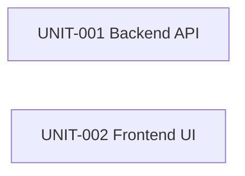

<!-- template_id: unit-decomposition-template.md -->

# Unit Decomposition — TinyURL URL Shortener (Phase 1 MVP)

- **template_id**: unit-decomposition-template.md
- **run_id**: run-20260801T232309Z
- **node_id**: unit-decomposition
- **registry_output**: sdlc-docs/construction/units/unit-registry.yaml
- **status**: approved

## 1. Decomposition rationale (required)

The design (ADR-001..ADR-009) cleanly separates a **Spring Boot backend** (all business logic, data
model, validation, rate limiting, redirect) from an **Angular frontend** (submission UI). These live
in disjoint directory trees (`tiny-url-creator/backend/**` vs `tiny-url-creator/frontend/**`), so per
the `by_independent_unit` conflict rule they can be built concurrently. The frontend depends only on
the **fixed API contract** in the design, not on backend source, so no unit dependency edge is
required for parallel construction. Two units result.

## 2. Units (required)

| UNIT id | Name | Depends on | Target files | Requirements | Risk | High-impact |
|---------|------|-----------|--------------|--------------|------|-------------|
| UNIT-001 | Backend URL-shortener API | — | `tiny-url-creator/backend/**` | REQ-001,002,003,004,005,006,008,009,010 | medium | false |
| UNIT-002 | Frontend submission UI | — | `tiny-url-creator/frontend/**` | REQ-007 | low | false |

Both units are `construction`-owned and non-high-impact individually; the parent `implementation`
node is high-impact and carries the durable construction confirmation (§8).

## 3. Parallelization plan (required)

- UNIT-001 and UNIT-002 have **disjoint `target_files`** → may run **concurrently**.
- Integration verification (frontend calling the real backend) is covered later by the `testing`
  node against the agreed contract; it does not force a build-time dependency.

## 4. Dependency graph (required)

Acyclic; no edges (both independent). ✔

## 5. Traceability (required)

- UNIT-001 → REQ-001/002/003/004/005/006/008/009/010 ; ADR-001/003/004/005/006/007/008/009.
- UNIT-002 → REQ-007 ; ADR-002.

## 6. Open questions (required)

N/A — the API contract and scope are fixed by the approved requirements and architecture; no open
questions remain.
